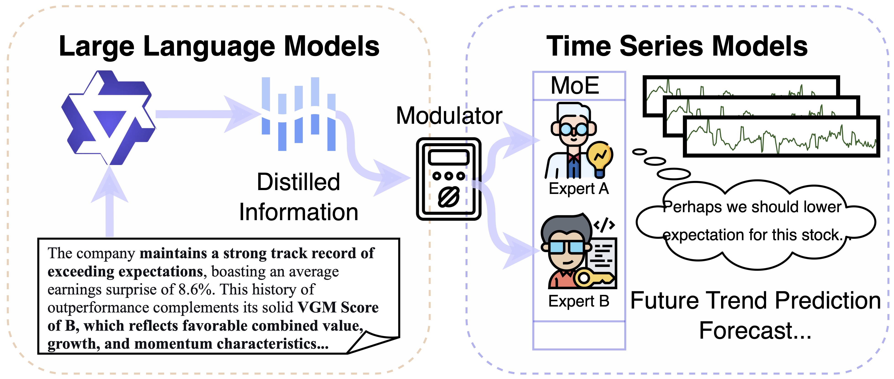
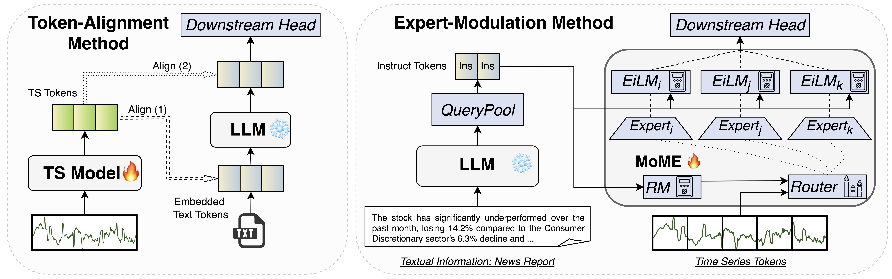

<h1 align="center">
  </a><br>
  <b>Mixture of Modulated Experts: Modality Interaction via Expert Modulation</b><br>
</h1>

<div align="center" style="line-height: 1;">
  <a href=""></a>
  <a href="https://arxiv.org/pdf/2503.16858"></a>
</div>

## Table of Contents

- [Table of Contents](#table-of-contents)
- [1. Abstract](#1-abstract)
- [2. Folder Structure](#2-folder-structure)
- [3. Dataset and Pre-Trained LLMs](#3-dataset-and-pre-trained-llms)
  - [Dependencies](#dependencies)
  - [Download Dataset](#download-dataset)
  - [Pre-trained LLMs](#pre-trained-llms)
- [4. Model Usage](#4-model-usage)
  - [Quick Run](#quick-run)
  - [Main Experiments](#main-experiments)
  - [Ablation Experiments](#ablation-experiments)
- [5. Experimental Results](#5-experimental-results)
  - [Results on MT-Bench and TimeMMD](#results-on-mt-bench-timemmd)
  - [Ablation Results](#ablation-results)
  - [Case Study](#case-study)
- [6. Contribution and Future Work](#6-contribution-and-future-work)
- [7. Additional Functions for Further Investigation](#7-additional-functions-for-further-investigation)
- [8. Citation and License](#8-citation-and-license)

## 1. Abstract

The non-stationary dynamics of real-world time series make accurate forecasting extremely challenging. To address this limitation, recent work has explored leveraging multi-modal signals, such as news reports, typically by aligning time series patches with language tokens in a shared embedding space. However, this strategy can be ill-suited for time series, due to the sparse and heterogeneous nature of temporal tokens. Prior empirical results also demonstrate that those models do not consistently outperform uni-modal baselines in many settings. In parallel, recent advances also show that Mixture-of-Experts (MoE) architectures are effective for time series modeling by enabling specialization across temporal patterns. These observations motivate us to explore a reliable form of cross-modal interaction based on the MoE framework. In this work, we introduce a new paradigm of multi-modal learning: use modality signals to directly modulate expert behavior, forming a lightweight yet expressive channel of modal interaction. Through theoretical analysis and experiments, we show that this expert-modulation mechanism yields substantial improvements in multi-modal time series prediction. Beyond time series, our findings point to a broader implication: expert-level modulation offers a principled paradigm for multi-modal learning beyond token-level modeling.

## 2. Folder Structure

```
MoME/
│── data/                           # Downloaded datasets
    ├── raw/                        # Text or timeseries only dataset
    ├── processed/                  # Task-specific dataset
│── data_preparation/               # Dataset preparation scripts
    ├── weather/                    # Scripts for weather data processing
    ├── finance/                    # Scripts for financial data processing
│── evaluation/                     # Evaluation scripts for benchmarking
    ├── weather/                    # Evaluation scripts for weather data
    ├── finance/                    # Evaluation scripts for finance data
    |── api_call.py                 # Functions for calling LLM APIs
│── requirements.txt                # Dependencies
|── download_raw_dataset.py         # Download the raw dataset
|── download_processed_dataset.py   # Download all processed dataset
│── README.md                       # Project documentation
```

## 3. Dataset and Pre-Trained LLMs

Main experiments are conducted on two multi-modal time series benchmarks from MT-Bench, covering two domains: [weather, finance]; TimeMMD, convering four domains: [Environment, Energy, Infectious Disease, Social Good]. Each dataset consists of structured time series data and textual questions that require understanding of time-dependent trends.

### Dependencies

Run the following commands to create a conda environment for MTBench

```bash
git clone https://github.com/BruceZhangReve/MoME.git
cd MoME

conda env create -f environment.yml -n MoME
conda activate MoME
```

### Download Dataset

Raw dataset can be accquired at this page:
```
https://img.shields.io/badge/Hugging_Face-MTBench-yellow?logo=huggingface (Please Revise)
```
Please put the downloaded raw data at "./data/raw" directory.
The pre-processed data can be accquired at this page:
```
https://img.shields.io/badge/Hugging_Face-MTBench-yellow?logo=huggingface (Please Revise)
```
Please put the downloaded raw data at "./data/processed" directory.

For testing convinience, we also provide some *ready-to-use* data in the "./data/saved_datasets" directory (You may also delete these files, then when running the trainging script, it will automatically create these *.pkl* files in this directory as well).

### Pre-trained LLMs

In this codebase, GPT2 (for GPT4TS baseline) and Qwen-MoE[A2.7B] (for others) are utilized. Please use the following HuggingFace links to download them and put under the "./llm" directory.
<div align="center" style="line-height: 1;">
  <a href=""></a>
  <a href=""></a>
</div>

## 4. Model Usage

<div align="center">
  
</div>
We summarize the proposed multi-modal learning architecture by figure above, also in comparison with conventional fusion methods.

Under *bfloat16* setting, the model training and evaluation can be performed on a single GPU that has 48GB memory (e.g., A6000). Under *float32*, it usually requires multiple GPUs to train the model. Here, we provide some example commands for training. There are a few key hyperparameters to mention. *--modulation* means that the *EiLM (Expert independent Linear Modulation)* is activated to enable multi-modal integration; *--n_experts* refers to the total number of experts for MoE; the *--topk* refers to the number of activated experts; *--instructor_query* refers to the number of instruct tokens (generated from LLMs) used to modulate the experts in the time series model. There are other hyperparameters such as *--finance_trend_choice 3way* or *--weather_trend_choice future*, please refer to the paper for them.

### Quick Run


### Main Experiments

#### Training
For instance, you can train a model that performs financial forecasting:
```
python train_neue.py --instructor_query 3 --n_experts 4 --topk 2 --modulation --output_dir output/finance_forecast  --task finance_forecast --in_len 134 --out_len 33 --data_pkl_dir ./data/saved_datasets/finance_forecasting --dataset_path ./data/processed/finance/pair_in_30days_1hours_out_7days_1hours --data_suffix in30_out7 --epoch 8 --hidden_dim 32 --patch_len 8 --ts_encoder MoMe --use_bfloat16
```
You can train a model that performs financial trend prediction:
```
python train_neue.py --instructor_query 3 --n_experts 4 --topk 2 --modulation --task finance_trend_prediction --in_len 134 --out_len 3 --finance_trend_choice 3way --data_pkl_dir ./data/saved_datasets/finance_trend_prediction --output_dir output/FT3 --dataset_path ./data/processed/finance/pair_in_30days_1hours_out_7days_1hours --data_suffix in30_out7 --epoch 10 --ts_encoder MoME --use_bfloat16 
```
You can train a model that performs weather forecasting:
```
python train_neue.py --instructor_query 3 --n_experts 4 --topk 2 --modulation --task weather_forecast --in_len 168 --out_len 24 --data_pkl_dir ./data/saved_datasets/weather_forecasting --output_dir output/WF --dataset_path ./data/processed/weather/aligned_in7days_out1days --data_suffix in7_out1 --epoch 10 --hidden_dim 32 --patch_len 8 --ts_encoder MoMe --use_bfloat16
```
You can train a model that performs weather trend prediction:
```
python train_neue.py --instructor_query 2 --n_experts 4 --topk 2 --modulation --task weather_trend_prediction --in_len 168 --weather_trend_choice future --data_pkl_dir ./data/saved_datasets/weather_trend_prediction --output_dir output/WT --dataset_path ./data/processed/weather/aligned_in7days_out1days --data_suffix in7_out1 --epoch 5 --hidden_dim 32 --patch_len 8 --ts_encoder MoMe --use_bfloat16
```
You can train a model that performs other domain forecasting:
```
python train_neue.py --instructor_query 3 --n_experts 4 --topk 2 --modulation --task socialgood_forecast --in_len 14 --out_len 3 --output_dir output/SocialGood-MoME --dataset_path ./data/processed/TimeMMD/SocialGood/train  --batch_size 1 --epoch 8 --hidden_dim 32 --patch_len 4 --ts_encoder MoMe --use_bfloat16 
```


#### Evaluation

### Ablation Experiments

#### Training

#### Evaluation


## 6. Experimental Results

We benchmark several state-of-the-art LLMs. The performance varies across different temporal reasoning tasks, highlighting areas for improvement in existing LLMs.

### Results on MT-Bench and TimeMMD

Evaluation on short-term finance data (*e.g.,* 7-day input, 1-day output). "➡️" indicates the performance change between *Time Series-Only* and *Time Series + Text* Input.


|              |  Trend Prediction<br/> (ACC)  | Technical Indicator (MSE) | Correlation (ACC) | MCQA (ACC) |
| ------------ | :---------------------------: | :-----------------------: | ----------------- | ---------- |
| **GPT-4o**   | 40.93 ➡️ 42.81 | 0.430 ➡️ 0.365 | 53.6              | 65.1       |
| **Gemini**   |   41.30 ➡️ 47.30   | 0.482 ➡️ 0.384 | 51.8              | 63.6       |
| **Claude**   |   41.20 ➡️ 44.90   | 0.241 ➡️ 0.373 | 50.4              | 75.6       |
| **DeepSeek** |   40.53 ➡️ 45.12   | 0.435 ➡️ 0.352 | 50.0              | 77.6       |

### Ablation Results


|              | Temperature Forecasting (MSE) |  Trend Prediction (ACC)  | Temperature Difference (MSE) | MCQA (ACC) |
| ------------ | :---------------------------: | :-----------------------: | :--------------------------: | :--------: |
| **GPT-4o**   |   21.67 ➡️ 17.55   | 23.07 ➡️ 43.54 |  27.06 ➡️ 18.84  |    41.7    |
| **Gemini**   |   25.75 ➡️ 24.31   | 17.91 ➡️ 51.76 |  35.72 ➡️ 23.21  |    43.4    |
| **Claude**   |   30.34 ➡️ 22.48   | 33.23 ➡️ 56.87 |  21.03 ➡️ 19.10  |    51.8    |
| **DeepSeek** |   31.02 ➡️ 29.38   | 16.89 ➡️ 25.17 |  49.28 ➡️ 44.99  |    46.7    |

### Case Study
We compare our method with some ablation models and baseline (also keeping shared hyperparameters identical). One sample result is as follows:
<div align="center">
  
</div>


## 5. Contribution and Future Work

We invite contributions to improve MTBench, including:

* Expanding dataset diversity with new domains.
* Enhancing task formulation for more complex temporal reasoning.
* Developing evaluation metrics tailored for multimodal time series reasoning.
* Designing novel and effective architectures and altorihtms for multimodal time series reasoning.


## 7. Additional Functions for Further Investigation
We also provide some template scripts to generate time-series-aligned news report in the codebase, which allows users for further investigations. We will provide the instructions for using these codebases soon...


## 8. Citation and License

This code repository is licensed under [the MIT License](LICENSE-CODE).

If you find MTBench useful, please consider citing our paper:

```bibtex
@article{chen2025mtbench,
  title={MTBench: A Multimodal Time Series Benchmark for Temporal Reasoning and Question Answering},
  author={Chen, Jialin and Feng, Aosong and Zhao, Ziyu and Garza, Juan and Nurbek, Gaukhar and Qin, Cheng and Maatouk, Ali and Tassiulas, Leandros and Gao, Yifeng and Ying, Rex},
  journal={arXiv preprint arXiv:2503.16858},
  year={2025}
}
```
