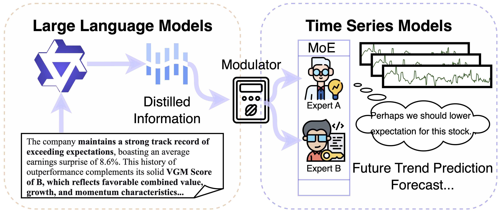
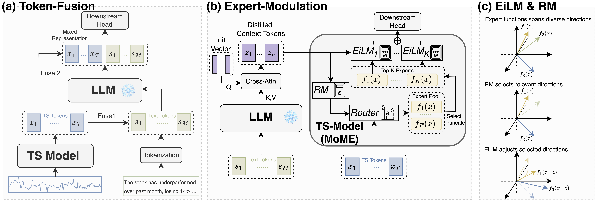

<h1 align="center">
  </a><br>
  <b>Multi-Modal Time Series Prediction via Mixture of Modulated Experts</b><br>
</h1>

<div align="center">

[](https://arxiv.org/abs/2601.21547)
[](https://www.python.org/downloads/release/python-3100/)
[](https://pytorch.org/)

</div>

## 📋 Table of Contents

- [Abstract](#abstract)
- [Method Overview](#method-overview)
- [Folder Structure](#folder-structure)
- [Installation](#installation)
- [Datasets and Pre-trained Models](#datasets-and-pre-trained-models)
  - [Datasets](#download-datasets)
  - [Pre-trained LLMs](#pre-trained-llms)
- [Usage](#usage)
  - [Training](#training)
  - [Evaluation](#evaluation)
  - [Expert Selection Analysis](#expert-selection-analysis)
- [Experimental Results](#experimental-results)
  - [Main Results](#main-results)
  - [Ablation Study](#ablation-study)
- [Citation](#citation)
- [Acknowledgements](#acknowledgements)

## 1. Abstract

Real-world time series exhibit complex and evolving dynamics, making accurate forecasting extremely challenging. Recent multi-modal forecasting methods leverage textual information such as news reports to improve prediction, but most rely on token-level fusion that mixes temporal patches with language tokens in a shared embedding space. However, such fusion can be ill-suited when high-quality time–text pairs are scarce and when time series exhibit substantial variation in scale and characteristics, thus complicating cross-modal alignment.

To address this, we propose **Expert Modulation**, a new paradigm for multi-modal time series prediction that conditions both routing and expert computation on textual signals, enabling direct and efficient cross-modal control over expert behavior. Through comprehensive theoretical analysis and experiments, our proposed method demonstrates substantial improvements in multi-modal time series prediction.

**Key Contributions:**
1. **Expert Modulation**: A principled alternative to token-fusion that integrates temporal and textual signals by modulating expert routing and computation within an MoE framework
2. **Theoretical Insight**: Geometric interpretation of MoE and provable expressivity of expert modulation 
3. **Generality**: Works across multiple time series backbones and consistently outperforms representative baselines

## 2. Method Overview

<div align="center">
  
  <p><em>Illustration of conventional token fusion (a), our proposed Expert Modulation (b), a geometric intuition of our method (c)</em></p>
</div>

## 3. Folder Structure

```
MoME/
├── API-Prompt-Evaluation/      # Evaluate prompt-based methods on MT-Bench
├── TS_Encoder/                 # Time series encoder implementations
│   ├── mome.py                 # MLP-based MoME model (proposed method)
│   ├── MiTransformer.py        # Transformer-based MoME model (proposed method)
│   ├── mmlinear.py             # Linear-based MoME model (proposed method)
│   ├── patchTST.py             # PatchTST baseline
│   ├── iTransformer.py         # iTransformer baseline
│   ├── dlinear.py              # DLinear baseline
│   ├── timellm.py              # Time-LLM baseline
│   ├── GPT4TS.py               # GPT4TS baseline
│   ├── TSMix.py                # TSMixer baseline
│   ├── TimeMoE-50M/            # Pre-trained Time-MoE model
│   └── utils/                  # Utility functions
├── data/
│   ├── dataset.py              # Dataset implementations (12 datasets across 3 benchmarks)
│   ├── dataloader.py           # Data loading utilities
│   ├── processed/              # Processed datasets
│  
├── data_preparation/           # Data processing scripts
│   ├── finance/                # Financial data processing
│   ├── weather/                # Weather data processing
│   ├── TimeMMD/                # TimeMMD benchmark processing
│   └── TimeIMM/                # Time-IMM benchmark processing (new)
├── llm/                        # Pre-trained LLM models and utility layers
│   ├── layers.py               # Alignment and prediction heads
│   ├── utils.py                # LLM utility functions
│   └── Qwen1.5-MoE-A2.7B/      # Qwen-MoE 2.7B weights
├── output/                     # Trained model checkpoints and outputs
├── asset/                      # Images for documentation
├── modulation_layers.py        # QueryPool for extracting textual instructions
├── utils.py                    # General utility functions
├── train.py                    # Main training script for MoME
├── train_fusion.py             # Training script for late fusion baselines
├── evaluate.py                 # Main evaluation script
├── evaluate_fusion.py          # Evaluation for late fusion baselines
└── environment.yaml            # Conda environment specifications
```

## 4. Installation

Clone the repository and create the conda environment:

```bash
git clone https://github.com/BruceZhangReve/MoME.git
cd MoME

conda env create -f environment.yaml -n MoME
conda activate MoME
```

**Key Dependencies:**
- Python 3.10
- PyTorch 2.5.1
- Transformers 4.52.3
- Pandas 2.2.3
- NumPy 2.2.6

**Memory Requirements:**
- With `--use_bfloat16`: Can run on a single GPU with 48GB memory (e.g., NVIDIA A6000)

## 5. Datasets and Pre-trained Models

### Download Datasets

We conduct experiments on three benchmarks:
- **MT-Bench**: Finance (stock price forecasting, trend prediction), Weather (temperature forecasting, trend prediction)
- **TimeMMD**: Environment, Energy, Infectious Disease, Social Good
- **Time-IMM (New)**: EPA Air Quality, GDELT (Canada), ILINet

Datasets are available in the ```data``` folder.


### Pre-trained LLMs

In this codebase, GPT2 (for GPT4TS baseline) and Qwen-MoE 1.5-A2.7B (for other methods) are utilized. Download them from HuggingFace and place under `./llm/`:

- GPT2: https://huggingface.co/openai-community/gpt2
- Qwen1.5-MoE-A2.7B: https://huggingface.co/Qwen/Qwen1.5-MoE-A2.7B

## 6. Usage

### Key Hyperparameters

| Hyperparameter | Description | Typical Value |
|----------------|-------------|---------------|
| `--modulation` | Enable EiLM expert modulation | Flag |
| `--router_modulation` | Enable router modulation | Flag |
| `--n_experts` | Total number of experts | 4 |
| `--topk` | Number of activated experts per patch | 2 |
| `--instructor_query` | Number of instruction tokens | 2-3 |
| `--lambda_e` | Weight for router modulation | 0.75 |

### Training

**Financial forecasting (long horizon):**
```bash
python train.py --instructor_query 3 --n_experts 4 --topk 2 \
  --modulation --router_modulation --output_dir output/finance_forecast_long \
  --task finance_forecast --in_len 134 --out_len 33 \
  --dataset_path ./data/processed/finance/long/train \
  --epoch 15 --hidden_dim 32 --patch_len 8 --ts_encoder MoMe --use_bfloat16
```

**Financial forecasting (short horizon):**
```bash
python train.py --instructor_query 3 --n_experts 4 --topk 2 \
  --modulation --router_modulation --output_dir output/finance_forecast_short \
  --task finance_forecast --in_len 312 --out_len 78 \
  --dataset_path ./data/processed/finance/short/train \
  --epoch 15 --hidden_dim 32 --patch_len 8 --ts_encoder MoMe --use_bfloat16
```

**SocialGood/Environment forecasting:**
```bash
python train.py --instructor_query 3 --n_experts 4 --topk 2 --modulation --\
  --task socialgood_forecast --in_len 14 --out_len 3 \
  --output_dir output/SocialGood-MoME \
  --dataset_path ./data/processed/TimeMMD/SocialGood/train \
  --epoch 8 --hidden_dim 32 --patch_len 4 --ts_encoder MoMe --use_bfloat16
```

### Evaluation

**Full test set evaluation:**
```bash
python evaluate.py --task finance_forecast --in_len 134 --out_len 33 \
  --dataset_path ./data/processed/finance/long/test \
  --checkpoint_path output/finance_forecast_long/ts_encoder_epoch9.pt \
  --output_dir ./output/finance_forecast_long --hidden_dim 32 --patch_len 8 \
  --n_experts 4 --topk 2 --ts_encoder MoMe --modulation --router_modulation \
  --instructor_query 3 --use_bfloat16 --eval_mode full_test
```

**Random sample visualization:**
```bash
python evaluate.py [...] --eval_mode random_sample --sample_seed 77
```
This will automatically generate a visualization comparing input, ground truth, and prediction.

### Expert Selection Analysis

To analyze how experts are selected for different textual instructions:

```bash
CUDA_VISIBLE_DEVICES=0 python evaluate.py --task socialgood_forecast \
  --in_len 14 --out_len 3 \
  --dataset_path ./data/processed/TimeMMD/SocialGood/test \
  --checkpoint_path output/socialgood_momer/ts_encoder_epoch9.pt \
  --output_dir ./output/Expert_Selection/socialgood_momer \
  --hidden_dim 32 --patch_len 4 --n_experts 4 --topk 2 --ts_encoder MoMe \
  --modulation --router_modulation --instructor_query 3 --use_bfloat16 \
  --return_expert_selection --eval_mode expert_selection
```

## 7. Experimental Results

### Main Results

|                              | PatchTST | Time-MoE* | DLinearP+LLM | MoME (Ours) |
|------------------------------|:--------:|:---------:|:-----------:|:-----------:|
| **Stock Price Forecast (MAPE)**   |   3.832  |   4.564   |    4.010     |   **3.523** |
| **Stock Price Trend (Acc)**      |  39.674  |  42.391   |    49.315    |  **66.849** |
| **US Infectious Disease (MSE)**  |   1.503  |   0.789   |    0.587     |   **0.379** |
| **Temperature Forecast (MAE)**   |   2.875  |   5.010   |    2.809     |   **2.620** |

*Note: For foundation models like Time-MoE, we only train the prediction head while keeping pre-trained parameters frozen.

### Ablation Study

|                              | MoME (w/o EM) | MoME (w/ EM) |
|------------------------------|:---------------:|:--------------:|
| **Stock Price Forecast (MAPE)**   |      3.758      |      **3.523**       |
| **Stock Price Trend (Acc)**      |      45.108     |    **66.849**   | 
| **US Infectious Disease (MSE)**  |      0.808      |     **0.379**   |
| **Temperature Forecast (MAE)**   |      2.785      |      **2.741**       |

*EiLM = Expert independent Linear Modulation, RM = Router Modulation

### Case Study

<div align="center">
  
  <p><em>Visual comparison of predictions from different methods on a stock price forecasting example</em></p>
</div>

## 8. Citation

If you find MoME useful, please consider citing our paper:


## 9. Acknowledgements

We thank the following repositories for reference:

* MT-Bench: https://github.com/Graph-and-Geometric-Learning/MTBench
* TimeMMD: https://github.com/AdityaLab/Time-MMD
* Time-MoE: https://github.com/Time-MoE/Time-MoE
* Time-LLM: https://github.com/KimMeen/Time-LLM
* One Fits All: https://github.com/DAMO-DI-ML/NeurIPS2023-One-Fits-All
